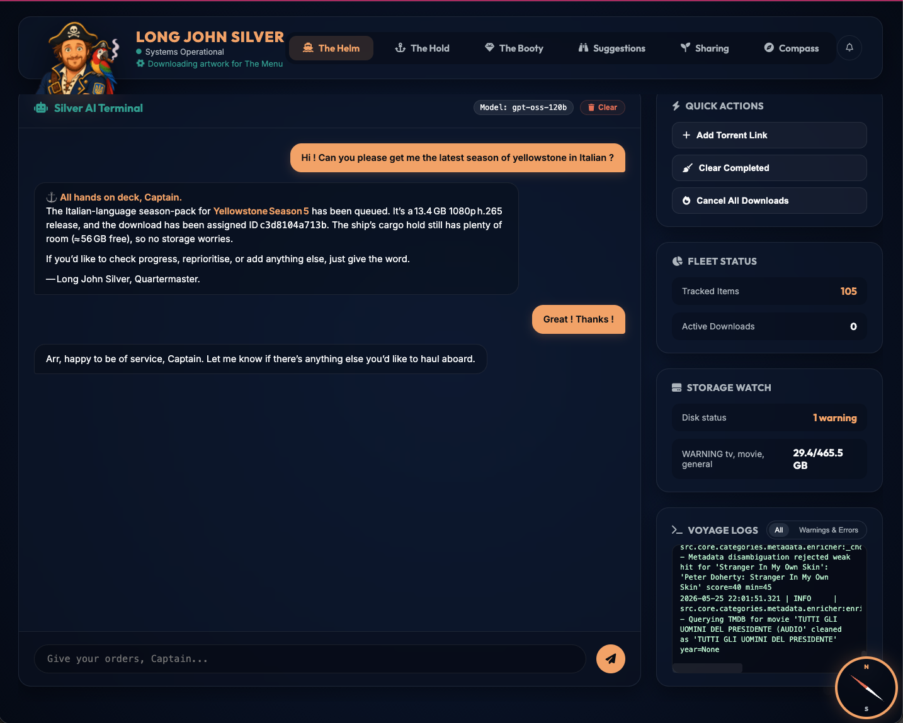
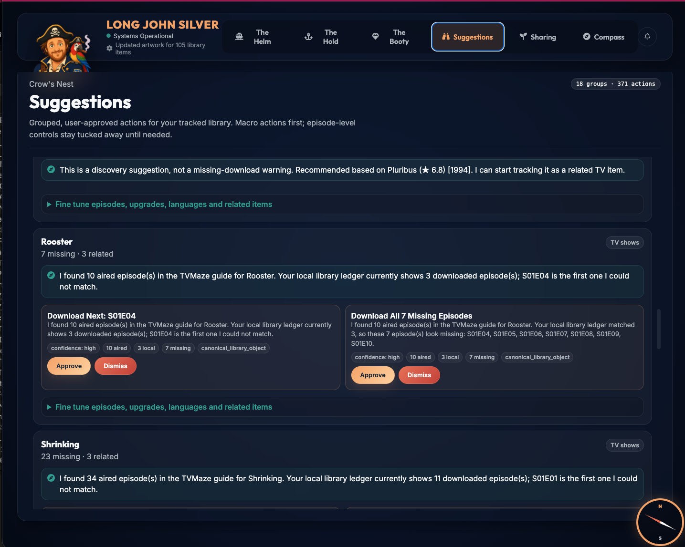
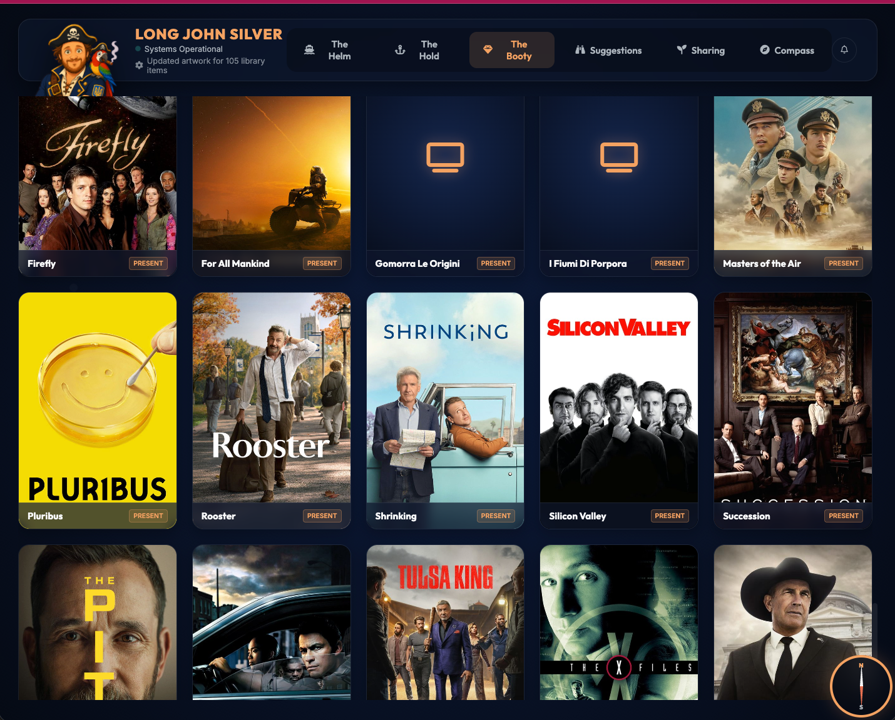

<div align="center">
  

# Long John Silver

**A friendly local AI quartermaster for your media library, downloads, and reminders.**

[Repository](https://github.com/orb84/Long-John-Silver) · [Maintainer](https://github.com/orb84) · [Support](SUPPORT.md) · [License](LICENSE)
</div>

Long John Silver, or **LJS**, is a self-hosted assistant that helps you manage a local media library from a web dashboard or chat. You can ask it for things in normal language: find a show, download the next missing episode, explain why it suggested something, remind you later, check again in a few weeks, or help keep your library organized.

You do **not** need to be an experienced developer to understand the idea:

1. You run LJS on your own computer, home server, or mini-PC.
2. You connect it to an LLM provider, such as NVIDIA NIM, OpenRouter, OpenAI-compatible APIs, LM Studio, vLLM, or another local endpoint.
3. You configure where your TV, movie, and general files libraries live.
4. You connect optional metadata services such as TMDB so LJS can recognize titles, artwork, seasons, episodes, casts, years, and release information more accurately.
5. You talk to it from the web UI, Discord, Telegram, WhatsApp, or another bridge.

The design principle is simple:

> The LLM reasons and chooses. The app validates, stores, executes, and protects. Categories define domain behavior. Bridges only transport messages.

LJS does not include media content, indexer accounts, API keys, or any right to access copyrighted material. Use it only with sources and downloads you are legally allowed to access in your jurisdiction.

---

## Screenshots

<p align="center">
  
  
  
</p>

---

## What LJS can do

| Area | What it means in plain English |
|---|---|
| Chat with your library | Ask questions like “what am I missing?”, “download the latest season in Italian”, or “why did you suggest this?” |
| Search and queue downloads | LJS searches through configured torrent/indexer sources, ranks candidates, and queues the right one only after app-side validation. |
| Keep categories separate | TV logic belongs to TV. Movie logic belongs to Movies. General Files is deliberately conservative. Generic code should not hardcode category rules. |
| Inspect candidates safely | Large raw torrent results stay out of the LLM prompt. The model sees compact candidate IDs, summaries, and valid next actions. |
| Import completed files | Completed downloads are linked/copied into category-owned safe library paths, then reconciled with the local library state. |
| Suggest useful actions | The Suggestions page groups missing episodes, upgrades, related media, metadata repairs, and user-approved actions. |
| Remember active tasks | Follow-ups like “yes, the first one”, “actually, released movie”, or “try a season pack instead” should attach to the current task instead of starting from nothing. |
| Schedule future help | The assistant can create one-off reminders, one-off future checks, and recurring assistant prompts that survive restarts. |
| Surface diagnostics | Warnings, recoverable tool failures, setup requirements, and logs are visible from the UI. |

---

## The categories LJS launches with

LJS is **category-first**. A category owns its metadata, paths, search patterns, naming rules, lifecycle policy, prompt instructions, and UI settings.

### TV Shows

Use this for episodic libraries. TV owns seasons, episodes, aired/missing logic, season packs, full-series containers, local episode matching, TV artwork, and naming like:

```text
TV Shows / Show Name / Season 02 / Show Name - S02E04.mkv
```

A **TMDB API key is highly recommended** for TV because it improves title identity, seasons, artwork, cast, ratings, IDs, and release metadata. TVMaze can also help with episode schedules and aired/future episode checks.

### Movies

Use this for standalone films. Movies own title/year matching, artwork, cast, genres, runtime, quality upgrades, language/subtitle preferences, and movie-specific organization.

A **TMDB API key is highly recommended** here too. Without it, LJS can still run, but recognition, posters, years, and metadata repair will be weaker.

### General Files

Use this for exact miscellaneous things that do not fit richer categories: manuals, public-domain archives, datasets, PDFs, lectures, audio files, and other user-named payloads.

General Files is intentionally cautious. It should not hijack richer category requests, should preserve original filenames, and should inspect ambiguous or risky candidates before queueing.

### Music

Use this for albums, tracks, singles, EPs, discographies, and local audio libraries. Music owns artist/release identity, track/disc ordering, cover art needs, lossless/lossy format preferences, and audio quality details such as FLAC, ALAC, AAC, MP3, bitrate, sample rate, and bit depth.

The shared `audio` definition declares FFmpeg as the conversion dependency. The Music category exposes an Apple-friendly conversion workflow that keeps the source file and creates sidecar output such as ALAC in `.m4a` or AAC in `.m4a`.

### Audiobooks

Use this for narrated books. Audiobooks extend the shared `book` definition and mix in `audio`, because audiobook identity needs author/title/edition/language metadata while playback needs narrator, abridged/unabridged status, duration, chapters, M4B/M4A/MP3/FLAC formats, and optional audio conversion.

Audiobooks should not be satisfied by EPUB/PDF ebooks, and ebooks should not be satisfied by M4B/MP3 audiobooks unless the user explicitly changes format.

### Ebooks

Use this for digital books and comic archives: EPUB, PDF, AZW3, MOBI, DJVU, CBZ, and CBR. Ebooks own author/title/ISBN/edition/language/translator/device-format constraints, plus cover and metadata repair.

Ebooks extend the shared `book` definition but do not mix in `audio`, so they inherit book metadata services without inheriting FFmpeg or audio-conversion behavior.

---

## LLM setup: cloud, free development APIs, or local models

LJS needs an OpenAI-compatible chat-completions endpoint for intent routing, reasoning, summarization, and candidate evaluation.

Good options include:


### Local models

LJS is designed to work with local or self-hosted models too. You can run an OpenAI-compatible server through tools such as:

- LM Studio
- vLLM
- llama.cpp servers that expose an OpenAI-compatible API
- Ollama-compatible bridges or proxies
- self-hosted NVIDIA NIM containers on suitable NVIDIA GPUs

Local models are attractive because they keep more of your assistant traffic on your own machine. They may need a larger context window and careful model selection because LJS is a tool-using assistant, not just a chatbot.


### NVIDIA NIM

NVIDIA NIM is a strong place to start because NVIDIA provides hosted NIM APIs for development and testing through the NVIDIA Developer Program and API Catalog. In practice, this makes it a very good free development alternative while you are experimenting with LJS.

Useful links:

- NVIDIA NIM for developers: <https://developer.nvidia.com/nim>
- NVIDIA API Catalog / Build: <https://build.nvidia.com/>
- NIM documentation: <https://docs.nvidia.com/nim/index.html>

The setup wizard supports OpenAI-compatible provider configuration, so a NIM endpoint can be configured with its base URL, API key, and model name.

### Other hosted providers

OpenRouter, OpenAI-compatible commercial providers, and other API gateways can also work. LJS supports per-task model routing, so you can use a fast/cheap model for intent routing and a stronger model for difficult search/download decisions.

When an endpoint reports a real context window, LJS clamps prompts to that limit. If the endpoint does not report one, the fallback is only a safe default; explicit user context settings are allowed to go higher.

---

## Metadata and service keys

LJS keeps public templates separate from private live settings.

Tracked public files:

```text
config/settings.template.yaml
config/category-definitions/*.yaml        shareable category contracts, tools, LLM guidance, formats
config/category-config-templates/*.yaml   blank first-launch local config defaults

Example category files:
config/category-definitions/<category_id>.yaml
config/category-config-templates/<category_id>.yaml
```

Ignored private runtime files:

```text
config/settings.local.yaml
config/categories/*.yaml

Example live category file:
config/categories/<category_id>.yaml
data/
```

Put real API keys and private paths only in the UI-generated local files. Do not commit live settings. During first-run setup, users set one global `library_root`; each concrete category then defaults to `library_root/<category default folder>` unless the user enters a category-specific override. Setup/path saves create the root and effective category folders on a best-effort basis. TMDB/Trakt media services and media download preferences are saved through setup endpoints into ignored category config files; shareable category definitions stay clean.

Recommended integrations:

| Service | Why you may want it |
|---|---|
| TMDB | Highly recommended for TV/movie identity, artwork, years, cast, seasons, genres, and ratings. |
| TVMaze | Useful for TV episode schedules and aired/future episode checks. |
| Jackett / Torznab | Aggregates configured indexers for torrent searches. |
| Plex | Optional library refresh and watch-state reconciliation. |
| Trakt | Optional watched-state/taste integration. LJS ships a public Trakt app Client ID, so normal users should only link their account with the Trakt PIN/code flow; custom Client IDs are advanced overrides only. |
| OpenSubtitles | Optional subtitle search/download support. |
| MusicBrainz | Keyless music metadata for artists, releases, recordings, labels, dates, and tracklists. Use a meaningful user-agent and respect rate limits. |
| Cover Art Archive | Cover art metadata/images linked to MusicBrainz release IDs. |
| Open Library | Keyless book/work/edition metadata, identifiers, subjects, and covers. |
| Internet Archive | Public item metadata and files for public-domain books/audio and archive-backed metadata. |
| LibriVox | Keyless public-domain audiobook catalog metadata, readers/narrators, languages, durations, and archive links. |
| Gutendex | Keyless Project Gutenberg ebook metadata and public-domain format availability. |
| Google Books | Optional keyed fallback for broad book metadata and thumbnails, useful when free/keyless sources cannot disambiguate a commercial title. |
| Apple iTunes / Apple Books Search API | Optional keyless commercial/public catalog fallback for books and audiobooks, including store thumbnails and Apple-facing IDs. |
| Discogs | Optional keyed music fallback for exact physical/digital releases, labels, catalog numbers, and edition details. |
| AcoustID | Optional keyed audio-fingerprint lookup for future local music tag repair workflows. |
| Comic Vine | Optional keyed comics metadata/covers for CBZ/CBR graphic novel/comic-library workflows. |

---

## Chat bridges: web, Discord, Telegram, WhatsApp, and more

Every bridge should use the same shared assistant runtime:

```text
incoming bridge message
  → normalize session / sender / channel
  → call ChatSessionRunner + AIAssistant
  → stream progress and final response back to that bridge
```

That means Discord, Telegram, WhatsApp, the web UI, REST, and WebSocket chat should not each invent their own planning logic. They are transport adapters.

The shared runtime owns:

- intent routing;
- conversation context;
- active goals and pending result handles;
- progress cadence;
- tool registration and validation;
- category prompts and category-owned settings;
- user-facing errors and receipts.

A new bridge should only implement:

- how to receive messages;
- how to identify the user/channel/session;
- how to format responses for that platform;
- how to send progress/final messages back.

Discord, Telegram, and WhatsApp each have different formatting limits, so LJS injects platform guidance before answering. For example, Discord can use Markdown but has message length constraints; WhatsApp uses its own text formatting conventions.

---

## Automatic startup at login

LJS can be run manually while testing, but the intended home-server experience is that it is available after you log in. The built-in checkbox creates a **user-level launch-at-login entry**; it is not a privileged daemon and it does not install a system service.

The project includes startup integration documentation in:

```text
docs/AUTOSTART_BOOT_INTEGRATION.md
```

The goal is:

- LJS starts when the machine starts or when your user logs in;
- the web UI is available without opening a terminal;
- the scheduler can run reminders and future checks after restarts;
- completed downloads can be imported/reconciled even if you are not actively watching the UI.

The built-in checkbox currently writes these per-user entries:

| Platform | Built-in approach |
|---|---|
| macOS | LaunchAgent in `~/Library/LaunchAgents` |
| Linux desktop sessions | freedesktop `.desktop` entry in `~/.config/autostart` |
| Windows | Current-user `Run` registry value |

For headless Linux servers, Docker, NAS boxes, or packaged app releases, use an external supervisor such as a systemd unit or container restart policy. Keep that separate from the in-app checkbox so users can still understand exactly what LJS wrote.

For a first install, run LJS manually until your settings and paths are correct. Once it works, configure automatic startup so the assistant, scheduler, reminders, and future checks are available after login.

---

## Quick start

```bash
git clone https://github.com/orb84/Long-John-Silver.git
cd Long-John-Silver
./run.sh                 # Starts on port 8088
./run.sh 9000            # Custom port
LJS_PORT=3000 ./run.sh   # Port via environment variable
```

Then open the web UI and follow setup.

The first-run wizard helps configure:

- the LLM provider;
- library paths for TV, Movies, and General Files;
- TMDB and other optional services;
- search/indexer settings;
- chat bridges;
- storage thresholds and safety settings.

---


### WARNING ### 
THIS PROJECT IS STILL IN DEVELOPMENT. HARD AT IT. I WOULD LOVE TO RECEIVE FEEDBACK AND BUG REPORTS TO MAKE IT BETTER, BUT DON'T EXPECT A PERFECT EXPERIENCE, ESPECIALLY NOT WITH FIRST RELEASE ! 


## Runtime environment variables

Most configuration belongs in the UI or YAML files. The supported runtime environment variables are intentionally small:

```bash
LJS_PORT=8088
LJS_HOST=0.0.0.0
LJS_ACCESS_LOGS=quiet       # quiet | verbose
LJS_WEB_SECRET=<random secret for signed auth tokens>
LJS_ALLOW_INSECURE_DEV=1    # development only, used by run.sh/run.bat
```

---

## Architecture at a glance

```text
Web / Discord / Telegram / WhatsApp / REST
        │
        ▼
Shared ChatSessionRunner
        │
        ▼
AIAssistant
        │
        ├── LLM intent routing and language handling
        ├── compact conversation / active goal context
        ├── category manifests and prompt guidance
        └── registered tool catalog
                │
                ▼
       Contract-bound tool execution
                │
      ┌─────────┼──────────┐
      ▼         ▼          ▼
 Categories  Search /    Downloads
 contracts   indexers     queue/import
      │         │          │
      ▼         ▼          ▼
 Canonical  Candidate   Category-owned
 library    workspace   safe paths
 objects
```

Important boundaries:

- Generic code must not branch on TV/movie semantics.
- Categories define metadata, naming, lifecycle, storage layout, and search behavior.
- The LLM must call registered tools with schema-valid arguments.
- Raw torrent/search/provider payloads stay in app-owned workspaces.
- Bridges do not own planning, timeout policy, progress cadence, or category decisions.

See `architecture.md` and `AGENTS.md` before changing core behavior.

---

## Repository layout

```text
src/
  ai/               assistant runtime, prompt/context builders, tool contracts, tools
  core/             config, database, downloader, scheduler, category system, library logic
  integrations/     TMDB, TVMaze, Trakt, Plex and metadata adapters
  llm_providers/    OpenAI-compatible provider abstraction, key store, task routing
  search/           Jackett/Torznab, browser strategies, web-search helpers
  utils/            auth, browser runtime, bencode, quality, parsing, safety helpers
  web/              FastAPI app, routers, bridges, templates, frontend assets
config/
  settings.template.yaml   public fresh-install template, no secrets
  settings.local.yaml      ignored live settings created on first launch
  category-definitions/    public/shareable category contracts, tools, services, formats
  category-config-templates/ blank safe defaults for private per-category settings
  categories/              ignored live per-category settings
  personas/                assistant persona packages
migrations/         SQLite migrations applied on startup
scripts/            architecture, regression, and release-readiness checks
skills/             category creation guidance used by the assistant
```

---

## Compass / Settings

Compass is organized by ownership:

- **Content Selection** — shared Media category download-profile preferences such as language, resolution, bitrate, and size limits. TV Shows and Movies inherit these unless a category override is added later.
- **Library Categories** — category paths, service credentials, provider toggles, naming, lifecycle, scheduler, and storage controls.
- **Shared Torrent Search & Indexers** — Jackett and category-agnostic search infrastructure.
- **Advanced Category Contracts** — read-only manifest diagnostics for contributors and power users.
- **Diagnostics** — logs, warnings/errors, and recent agent/tool failures.

Existing installs can receive new bundled categories. The setup requirements endpoint lets the frontend detect unconfigured category requirements and prompt the user to review the new category path.

---

## Category development

Before creating a category, read:

- `architecture.md`
- `AGENTS.md`
- `skills/category_creation_guide.md`
- `docs/RELEASE_MAINTENANCE_REVIEW.md`

A category should define its own:

- identifier, display name, keywords, item types;
- setup requirements and category properties;
- search patterns and candidate interpretation rules;
- canonical library object shape;
- file import/consolidation paths;
- lifecycle and suggestion policy;
- LLM-facing prompt guidance;
- optional workflows/actions for UI buttons or suggestions.

Do not add category-specific behavior to generic services unless it is a neutral extension point used by all categories.

---

## Validation checks

```bash
python -m compileall src scripts main.py
python scripts/check_public_docs.py
python scripts/check_category_architecture.py
python scripts/check_ai_intent_architecture.py
python scripts/check_ai_context_architecture.py
python scripts/check_security_architecture.py
python scripts/check_model_facade_imports.py
python scripts/check_compatibility_shims.py
python scripts/check_architecture.py
```

Recent targeted regression scripts include:

```bash
python scripts/round102_llm_led_contract_tests.py
python scripts/round103_web_context_regression_tests.py
python scripts/round104_general_category_tests.py
python scripts/round105_settings_category_config_tests.py
python scripts/round106_release_readiness_tests.py
python scripts/round107_public_identity_tests.py
python scripts/round108_local_settings_bootstrap_tests.py
python scripts/round109_user_scheduling_tests.py
python scripts/round110_context_and_readme_tests.py
```

Full `pytest` requires the complete dependency set from `requirements.txt` and may not run in restricted sandboxes without optional runtime dependencies such as `aiosqlite` or `libtorrent`.

---

## Security and privacy notes

- The project is designed for local/self-hosted use.
- Destructive actions should return receipts and require confirmation.
- Safe path enforcement prevents completed downloads from escaping configured roots.
- API keys and OAuth tokens should not be committed.
- Browser/web-search helpers should surface typed recoverable errors rather than crashing the chat loop.
- See `SECURITY.md` for reporting and hardening notes.

---

## License

Long John Silver is free and open-source software licensed under the **GNU Affero General Public License v3.0 or later** (`AGPL-3.0-or-later`).

```text
Copyright © 2026 orb84 and contributors
```

See [LICENSE](LICENSE), [NOTICE](NOTICE), and [AUTHORS.md](AUTHORS.md).

---

## Support and contact

- Repository: <https://github.com/orb84/Long-John-Silver>
- Maintainer: <https://github.com/orb84>
- Contact: <orblaboratories@gmail.com>
- Support: see [SUPPORT.md](SUPPORT.md) and the repository for current ways to send a coffee my way (if you really want to help paying for my Claude subscription, any paypal orblaboratories@gmail.com would be greatly appreciated !)

