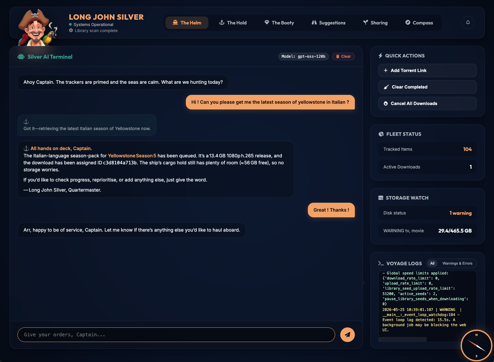
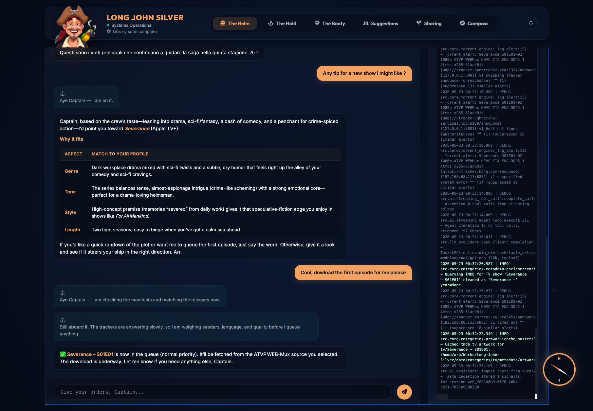

<div align="center">
  

# Long John Silver

**A local, category-driven AI quartermaster for media/library/download automation.**

[Repository](https://github.com/orb84/Long-John-Silver) · [Maintainer](https://github.com/orb84) · [Support](SUPPORT.md) · [License](LICENSE)
</div>

Long John Silver (LJS) is a self-hosted assistant that can search, evaluate,
queue, download, import, and maintain a local library through natural-language
chat. It is built around a strict principle:

> The LLM reasons and chooses. The app validates, stores, executes, and protects. Categories define domain behavior. Bridges only transport messages.

LJS started as a TV/movie automation tool, but the current architecture is
category-first. TV, Movies, and General Files are bundled categories; future
domains such as books, games, audiobooks, courses, or datasets should be added
by declaring category capabilities rather than by hardcoding new behavior into
the assistant or scheduler.

LJS does not include media content, indexer accounts, API keys, or any right to
access copyrighted material. Use it only with sources and downloads you are
legally allowed to access in your jurisdiction.

---

## Screenshots

<p align="center">
  
  
</p>

---

## Current capabilities

| Area | What LJS does |
|---|---|
| Natural-language assistant | Web, REST/WebSocket, Discord, and Telegram entry points share the same chat runtime. |
| LLM-led tool use | The model can reason, call registered tools, inspect candidate handles, and continue from active task context. |
| Contract-bound execution | Tool names, schemas, paths, destructive actions, result handles, and recoverable errors are validated by the app. |
| Category-owned behavior | Categories declare paths, metadata providers, search patterns, lifecycle policy, manifests, setup requirements, and LLM guidance. |
| Torrent candidate workspace | Search tools keep large raw result sets out of the prompt and expose compact candidate pickers plus inspectable IDs. |
| Library import | Completed downloads are planned through category-owned safe paths and reconciled back into canonical library objects. |
| Diagnostics | Logs, recoverable tool errors, and setup requirements are surfaced in the UI instead of hidden in backend traces. |
| Long-term context | Conversation memory, active goals, pending action handles, and category-scoped taste evidence keep the agent from relying on raw transcript replay. |

---

## Bundled categories

### TV Shows

TV owns episodic structure, seasons, episodes, pack-first search patterns,
aired/missing logic, metadata enrichment, Plex naming templates, lifecycle
intervals, and TV-specific LLM instructions. TV defaults live in `config/category-templates/tv.yaml`; your local runtime edits are saved to ignored `config/categories/tv.yaml`.

### Movies

Movies own standalone title/year matching, edition/quality handling, movie
metadata enrichment, flat or folder-based organization, and movie-specific
lifecycle decisions. Movie defaults live in `config/category-templates/movie.yaml`; local edits are saved to ignored `config/categories/movie.yaml`.

### General Files

General Files is for exact, user-named miscellaneous payloads that do not fit
richer categories. It is intentionally conservative: it should not hijack
TV/movie/book/game requests, it should preserve original filenames, and it
should inspect ambiguous or risky candidates before queueing. General settings
default to `config/category-templates/general.yaml`; local edits are saved to ignored `config/categories/general.yaml`.

---

## Architecture at a glance

```text
Web / Discord / Telegram / REST
        │
        ▼
Shared ChatSessionRunner
        │
        ▼
AIAssistant + AgentRunPreparer
        │
        ├── LLM intent routing and language handling
        ├── active goal / pending-action context
        ├── category manifests and prompt guidance
        └── registered tool catalog
                │
                ▼
       Contract-bound tool execution
                │
      ┌─────────┼──────────┐
      ▼         ▼          ▼
 Category   Search /     Downloads
 manifests  Jackett      libtorrent
      │      browser      queue/import
      ▼         │          │
 Canonical     ▼          ▼
 library   Candidate   Category-owned
 objects    workspace   safe import paths
```

Important boundaries:

- Generic code must not branch on TV/movie semantics.
- Categories define metadata, naming, lifecycle, storage layout, and search behavior.
- The LLM must call registered tools with schema-valid arguments; it must not invent JSON placeholders or internal paths.
- Raw torrent/search/provider payloads stay in app-owned workspaces. The LLM sees stable handles, compact summaries, and valid next actions.
- Bridges are transport adapters. They do not own planning, timeout policy, progress cadence, or category decisions.

See `architecture.md` and `AGENTS.md` before changing core behavior.

---

## Repository layout

```text
src/
  ai/               assistant runtime, prompt/context builders, tool contracts, tools
  core/             config, database, downloader, scheduler, category system, library logic
  integrations/     TMDB, TVMaze, Trakt, Plex and metadata adapters
  llm_providers/    OpenAI-compatible provider abstraction, key store, task routing
  search/           Jackett/Torznab, browser strategies, web-search helpers
  utils/            auth, browser runtime, bencode, quality, parsing, safety helpers
  web/              FastAPI app, routers, bridges, templates, frontend assets
config/
  settings.template.yaml   public fresh-install template, no secrets
  settings.local.yaml      ignored live settings created on first launch
  category-templates/      public category defaults: tv.yaml, movie.yaml, general.yaml
  categories/              ignored live per-category settings
  personas/                assistant persona packages
migrations/         SQLite migrations applied on startup
scripts/            architecture, regression, and release-readiness checks
skills/             category creation guidance used by the assistant
```

---

## Configuration model

The public repository tracks templates only. On first launch, LJS copies
`config/settings.template.yaml` to ignored `config/settings.local.yaml`. If an
older install still has `config/settings.yaml`, startup migrates it to
`config/settings.local.yaml` so you do not have to re-run setup.

Category defaults live in `config/category-templates/<category_id>.yaml`; live
category settings are copied to ignored `config/categories/<category_id>.yaml`
and rendered in Compass → Library Categories.

Examples of category-owned settings:

- library paths;
- naming templates;
- category service requirements;
- provider toggles such as TV `tmdb` / `tvmaze`;
- lifecycle and scheduler policy;
- storage inheritance rules.

Shared infrastructure settings stay global:

- LLM provider and task routing;
- web-search provider;
- Jackett/direct scraper plumbing;
- storage thresholds;
- web auth and server binding;
- assistant persona selection.

`Category Manifests` in the UI were renamed to **Advanced Category Contracts**.
That panel is read-only diagnostics: it shows what a category declares to the
UI/LLM and is not a separate settings form.

---

## Installation

### Prerequisites

| Dependency | Purpose |
|---|---|
| Python 3.10+ | Application runtime |
| libtorrent | Torrent engine |
| ffmpeg / ffprobe | Media probing and verification |
| Jackett | Torznab/indexer aggregation, optionally auto-managed by LJS |
| An OpenAI-compatible LLM endpoint | Assistant reasoning, intent routing, summarization, candidate judgment |

### Quick start

```bash
git clone https://github.com/orb84/Long-John-Silver.git
cd Long-John-Silver
./run.sh                 # Starts on port 8088
./run.sh 9000            # Custom port
LJS_PORT=3000 ./run.sh   # Port via environment variable
```

On first run, the setup wizard configures the LLM provider, category paths,
storage/search providers, optional metadata integrations, and chat bridges.

### Runtime environment variables

Most user configuration belongs in the UI or YAML files. The supported runtime
environment variables are intentionally small:

```bash
LJS_PORT=8088
LJS_HOST=0.0.0.0
LJS_ACCESS_LOGS=quiet       # quiet | verbose
LJS_WEB_SECRET=<random secret for signed auth tokens>
LJS_ALLOW_INSECURE_DEV=1    # development only, used by run.sh/run.bat
```

Use the setup wizard or Compass to write live credentials and paths to ignored
local files: `config/settings.local.yaml`, `config/categories/*.yaml`, and the
provider key store under `data/`. Do not edit or commit the public templates
with real API keys, bridge tokens, passwords, or private machine paths.

---

## LLM setup

LJS expects an OpenAI-compatible chat-completions endpoint. Common choices are
OpenRouter, OpenAI, NVIDIA NIM, vLLM, LM Studio, and Ollama-compatible local
servers.

The LLM config supports task tiers so cheap/fast models can handle routing and
summarization while stronger models handle complex reasoning:

```yaml
llm:
  active_provider: openrouter
  api_base: https://openrouter.ai/api/v1
  api_key: null
  model: openrouter/openai/gpt-4o
  max_context_tokens: null
  context_budget_percent: 85
  lightweight:
    model: openai/gpt-4o-mini
  standard:
    model: openai/gpt-4o-mini
  heavy:
    model: anthropic/claude-sonnet
```

When an endpoint reports a real context window, LJS clamps user settings to that.
If the endpoint cannot report one, the built-in fallback is only an automatic
default, not a hard cap against an explicit user setting.

---

## Compass / Settings

Compass is organized by ownership:

- **Library Categories** — category paths, category service credentials,
  provider toggles, naming, lifecycle, scheduler/storage controls.
- **Shared Torrent Search & Indexers** — Jackett and category-agnostic search infrastructure.
- **Advanced Category Contracts** — read-only manifest diagnostics for contributors and power users.
- **Diagnostics** — logs, warnings/errors, and recent agent/tool failures.

Existing installs can receive new bundled categories. The setup requirements
endpoint lets the frontend detect unconfigured category requirements and prompt
the user to review the new category path.

---

## Category development

Before creating a category, read:

- `architecture.md`
- `AGENTS.md`
- `skills/category_creation_guide.md`

A category should define its own:

- identifier, display name, keywords, item types;
- setup requirements and category properties;
- search patterns and candidate interpretation rules;
- canonical library object shape;
- file import/consolidation paths;
- lifecycle and suggestion policy;
- LLM-facing prompt guidance;
- optional workflows/actions for UI buttons or suggestions.

Do not add category-specific behavior to generic services unless it is a neutral
extension point used by all categories.

---

## Validation checks

The lightweight checks are designed to run even in minimal environments:

```bash
python -m compileall src scripts main.py
python scripts/check_public_docs.py
python scripts/check_category_architecture.py
python scripts/check_ai_intent_architecture.py
python scripts/check_ai_context_architecture.py
python scripts/check_security_architecture.py
python scripts/check_model_facade_imports.py
python scripts/check_compatibility_shims.py
python scripts/check_architecture.py
```

Recent targeted regression scripts include:

```bash
python scripts/round102_llm_led_contract_tests.py
python scripts/round103_web_context_regression_tests.py
python scripts/round104_general_category_tests.py
python scripts/round105_settings_category_config_tests.py
python scripts/round106_release_readiness_tests.py
python scripts/round107_public_identity_tests.py
```

Full `pytest` requires the complete dependency set from `requirements.txt` and
may not run in restricted sandboxes without optional runtime dependencies such
as `aiosqlite` or `libtorrent`.

---

## Security and privacy notes

- The project is designed for local/self-hosted use.
- Destructive actions should return receipts and require confirmation.
- Safe path enforcement prevents completed downloads from escaping configured roots.
- API keys and OAuth tokens should not be committed.
- Browser/web-search helpers are for assistant research and torrent candidate discovery; they should surface typed recoverable errors rather than crashing the chat loop.
- See `SECURITY.md` for reporting and hardening notes.

---

## License

Long John Silver is free and open-source software licensed under the **GNU
Affero General Public License v3.0 or later** (`AGPL-3.0-or-later`).

```text
Copyright © 2026 orb84 and contributors
```

See [LICENSE](LICENSE), [NOTICE](NOTICE), and [AUTHORS.md](AUTHORS.md).

---

## Support and contact

- Repository: <https://github.com/orb84/Long-John-Silver>
- Maintainer: <https://github.com/orb84>
- Contact: <orblaboratories@gmail.com>
- Support: see [SUPPORT.md](SUPPORT.md) and the repository for current ways to send a coffee my way.

---

## Project status

LJS is approaching open-source release but still has architectural debt in
several large classes, especially around assistant orchestration, TV/movie
category implementations, scheduler/download manager seams, and provider
clients. The current architecture checks report no hard findings, but the
size-risk warnings are real refactor candidates before a polished public v1.0.
